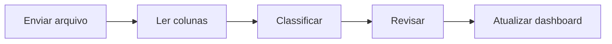

# 💰 FinAuto - Controle Financeiro Pessoal

> Aplicativo simples de controle financeiro pessoal com importação de extratos e visualização rápida de gastos.

---

## 📋 Índice

- [Visão Geral](#-visão-geral)
- [Problema](#-problema)
- [Solução MVP](#-solução-mvp)
- [Escopo](#-escopo)
- [Fluxos Principais](#-fluxos-principais)
- [Regras de Negócio](#-regras-de-negócio)
- [Requisitos Não Funcionais](#-requisitos-não-funcionais)
- [Métricas](#-métricas)
- [Riscos](#-riscos)

---

## 🎯 Visão Geral

O **FinAuto** é um aplicativo simples de controle financeiro pessoal que permite aos usuários importar extratos bancários (CSV e PDF estruturado) e visualizar rapidamente seus gastos através de um dashboard intuitivo. O foco está na facilidade de uso e na classificação automática de despesas.

---

## ❌ Problema

Usuários enfrentam dificuldades comuns no controle financeiro:

- ⏱️ Registrar manualmente todos os gastos consome tempo
- 📊 Classificar despesas de forma consistente é trabalhoso
- 🔍 Entender padrões de consumo sem visualização clara dos dados
- 🔧 Falta de ferramentas simples que não exigem integração bancária complexa

---

## ✅ Solução (MVP)

O MVP do FinAuto oferece:

| Funcionalidade | Descrição |
|----------------|-----------|
| 📥 **Importação de arquivos** | CSV e PDF estruturado (sem OCR) |
| 🔍 **Extração automática** | Data, descrição e valor das transações |
| 🏷️ **Classificação automática** | Baseada em palavras-chave predefinidas |
| ✏️ **Edição e exclusão** | Ajuste manual de transações importadas |
| 📊 **Dashboard mensal básico** | Visualização de gastos, receitas e categorias |

---

## 📦 Escopo

### ✅ Inclui:
- Cadastro simples de usuário
- Importação de extratos em CSV e PDF estruturado
- Classificação automática por palavras-chave
- Edição e exclusão de transações
- Dashboard com resumo mensal

### ❌ Exclui:
- OCR para PDFs não estruturados
- Integração direta com APIs bancárias
- IA avançada para classificação
- Processo de KYC (Know Your Customer)
- Exportação de relatórios complexos
- Múltiplas contas bancárias

---

## 🔄 Fluxos Principais

### 1️⃣ Importar Extrato

**Passos:**
1. Usuário envia arquivo (CSV ou PDF estruturado)
2. Sistema lê e extrai colunas (data, descrição, valor)
3. Sistema classifica automaticamente por palavras-chave
4. Usuário revisa transações importadas
5. Dashboard é atualizado com novos dados

### 2️⃣ Ajustar Categoria

**Passos:**
1. Usuário seleciona transação no dashboard
2. Usuário altera a categoria manualmente
3. Sistema oferece opção de aplicar regra para futuras transações similares
4. Dashboard reflete a mudança imediatamente

### 3️⃣ Dashboard

**Passos:**
1. Usuário acessa a tela principal
2. Sistema exibe resumo mensal (gastos totais, receitas, saldo)
3. Usuário visualiza gráfico de gastos por categoria
4. Usuário pode filtrar por categorias específicas

---

## 📜 Regras de Negócio

- 🔓 Sem necessidade de KYC ou verificação de identidade
- 📄 Apenas CSV e PDF estruturado são aceitos
- 🏷️ **Categorias fixas**: Alimentação, Transporte, Moradia, Saúde, Lazer, Educação, Outros
- 🤖 Classificação automática baseada em dicionário de palavras-chave
- ✏️ Usuário pode editar qualquer transação a qualquer momento
- 🔒 Dados armazenados de forma segura (sem compartilhamento)

---

## ⚙️ Requisitos Não Funcionais

| Requisito | Especificação |
|-----------|---------------|
| 🎨 **Interface** | Simples, intuitiva e responsiva (mobile-first) |
| ⚡ **Performance** | Importação de até 1000 transações em < 5s |
| 🔐 **Segurança** | Dados criptografados em repouso e em trânsito |
| 🔒 **Privacidade** | Dados não compartilhados com terceiros |
| 🌐 **Compatibilidade** | Chrome, Firefox, Safari, Edge |

---

## 📈 Métricas

Indicadores de sucesso do MVP:

- ✅ Número de importações concluídas com sucesso
- 🎯 Percentual de classificações automáticas aceitas
- ✏️ Número médio de correções manuais por importação
- 🔄 Taxa de retenção (retorno após 7 e 30 dias)
- ⏱️ Tempo médio para completar primeira importação

---

## ⚠️ Riscos

### Identificados:

| Risco | Mitigação |
|-------|-----------|
| 📄 Formatos de extrato inconsistentes | Orientação clara sobre formato CSV esperado |
| 🏷️ Classificação automática limitada | Edição rápida e intuitiva de classificações |

---

## 🚀 Próximos Passos

1. [ ] Definir stack tecnológico
2. [ ] Criar protótipo de interface
3. [ ] Implementar importação de CSV
4. [ ] Desenvolver classificação automática
5. [ ] Criar dashboard básico
6. [ ] Testes com usuários reais

---

## 📄 Documentação Adicional

- [PRD Completo](PRD_FinAuto.md)
- [Guia de Contribuição](CONTRIBUTING.md) _(em breve)_
- [Roadmap](ROADMAP.md) _(em breve)_

---

## 📝 Licença

Este projeto está sob a licença MIT. Veja o arquivo [LICENSE](LICENSE) para mais detalhes.

---

## 👥 Equipe

**Versão**: 1.0  
**Data**: Dezembro 2024  
**Status**: 📋 Planejamento MVP

---

  Feito com ❤️ para simplificar o controle financeiro pessoal

